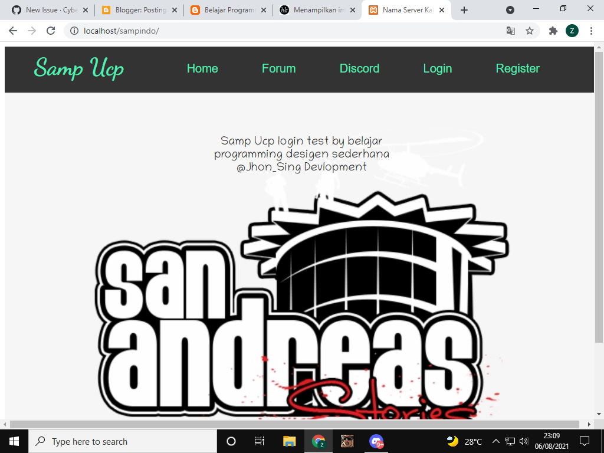
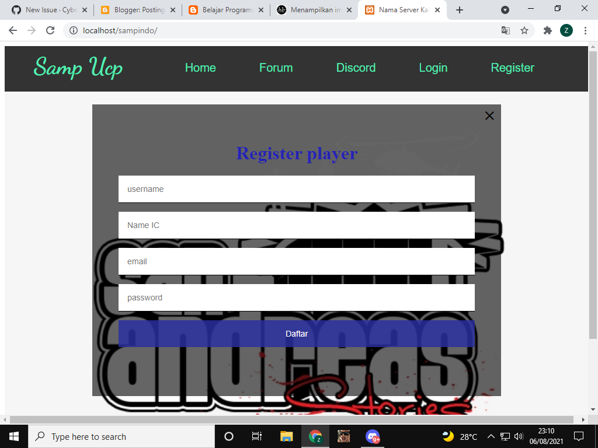
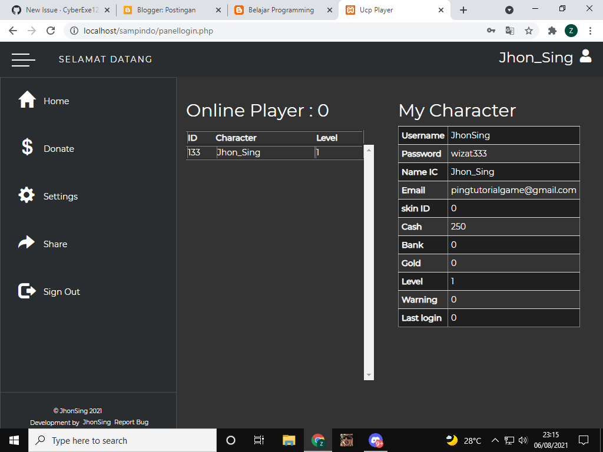

# **SAMPUCP**
English | [Indonesia](https://github.com/CyberExe12/SampUcp/blob/main/README.id.md)

## Description
---------------------------------
**SAMPUCP** - is a website panel for creating ucp simple servers with gammodes.

#### Version support
----------------------------------
* Client: SA:MP 0.3.7 (R1, R3)
* Server: SA:MP 0.3.7 (R2)

## Features
---------------------------------
* simple login and register
* simple system php
* use settings for user profile
* can see online player
* gammodes suport with jvrp
* you can modify the ucp feature
* setdonate player
* change password and email
* delay time for panel login user

## Installation
---------------------------------
install using vps server and phpmyadmin

##### Install for php
---------------------------------
1. In order to download the installer, head over to [`releases`](https://github.com/CyberExe12/SampUcp/releases) 
2. after successful download use vps/cpanel to install
3. use putty for vps ubuntu and install phpmysql into your vps
4. do a private player test using localhost if there is no vps/hosting

#### Quick reference
---------------------------------
* You need to know, use a php installation that supports the php website version so that the system can run properly
* subscribe get update to versi ucp [`subscribe`](https://www.youtube.com/channel/UCthZQqE6GbRpSZX99-NKCCw)
* follow me get website tutorial samp [`website`](https://forumsa-mp.blogspot.com/)

Thanks You.

## Screenshots

